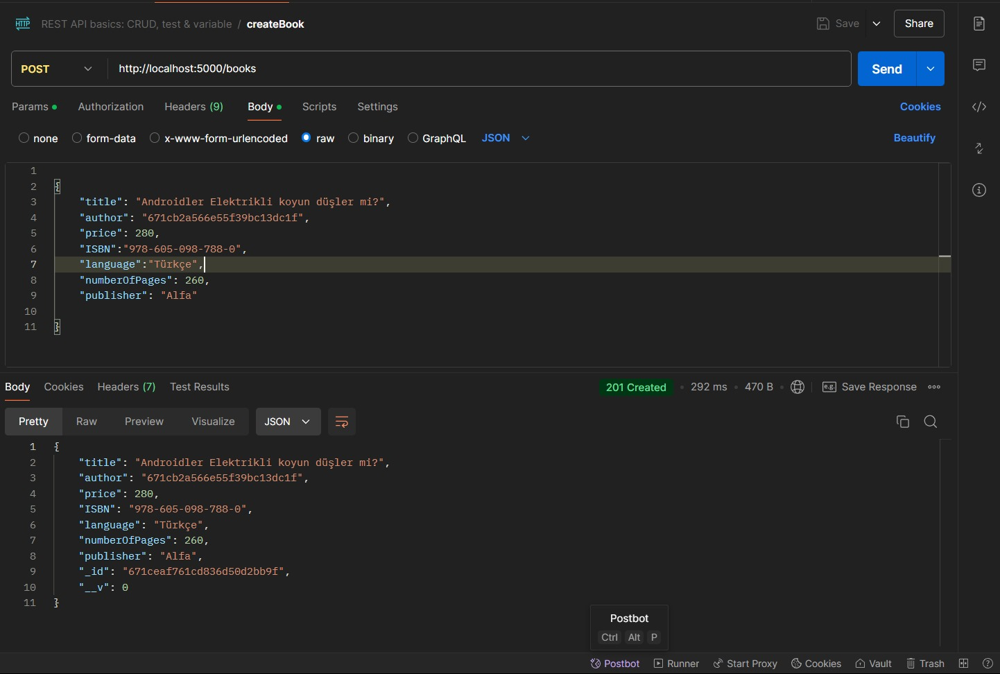

  ## Getting Started 🚀
### Clone the project  

~~~bash  
  git clone https://github.com/zeynep59/RESTful-api.git
~~~

Go to the project directory  

~~~bash  
  cd RESTful-api
~~~

Install dependencies  

~~~bash  
npm i
~~~
### mongodb server
  Install mongodb~~~
  create connection~~~
  create db  

### Start the server  

~~~bash  
npm run start
~~~  

### Example Request
  